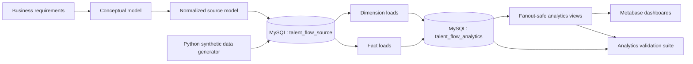

# Talent Flow Marketplace Analytics

A data modeling and business intelligence project focusing on large-scale job marketplace data.

Talent Flow models the full marketplace journey from employer job supply and sponsored campaigns to job-seeker searches, impressions, clicks, applications, and hires. The project demonstrates how to move from business requirements to a normalized operational model, a dimensional analytics layer, validated metrics, and interactive Metabase dashboards.

---

## Project goals

This project demonstrates how to:

- Translate marketplace processes into conceptual, logical, and dimensional data models.
- Build a normalized MySQL source schema with integrity constraints.
- Generate reproducible synthetic marketplace data with realistic funnel behavior.
- Design and populate a star schema for analytics.
- Prevent metric inflation caused by fact-to-fact fanout.
- Create reusable analytics views for BI consumption.
- Validate grains, row counts, foreign keys, business rules, and metric reconciliation.
- Build executive and diagnostic dashboards in Metabase.

---

## Business questions

### Marketplace funnel

- How many searches, impressions, clicks, applications, submissions, and hires occurred?
- What are the click-through and application conversion rates?
- How do marketplace outcomes change over time?
- Which employers, jobs, locations, and categories perform best?

### Search quality

- How often do searches return no results?
- How many results are returned per search?
- How does CTR vary by result position?
- Does predicted relevance correlate with observed engagement?
- Which queries represent the largest improvement opportunities?
- How does search quality differ by device and acquisition channel?

### Sponsored marketplace

- How much was spent by campaign and job?
- What are campaign CPC and CPA outcomes?
- How does billed activity reconcile to platform events?
- Are sponsored impressions and spend occurring inside campaign flight dates?
- Which campaigns convert spend into applications most efficiently?

---

## Technology stack

| Layer | Tool |
|---|---|
| Data modeling | dbdiagram.io / DBML |
| Operational database | MySQL 8.4 |
| Database administration | DBeaver Community |
| Synthetic data generation | Python, pandas, NumPy, Faker |
| Analytics transformations | MySQL SQL |
| BI and dashboards | Metabase Community |
| Version control | Git and GitHub |

This project intentionally does **not** use PostgreSQL.

---

## Architecture



The project uses two MySQL databases:

```text
talent_flow_source
talent_flow_analytics
```

- **`talent_flow_source`** stores normalized operational marketplace data.
- **`talent_flow_analytics`** stores conformed dimensions, facts, and dashboard-facing views.

---

## Repository structure

```text
talent-flow-data-model/
├── README.md
├── requirements.txt
├── dbml/
│   ├── 01_conceptual_model.dbml
│   ├── 02_source_logical_model.dbml
│   └── 03_analytics_star_schema.dbml
├── sql/
│   ├── 01_create_databases.sql
│   ├── 02_create_source_schema.sql
│   ├── 03_quality_checks_source.sql
│   ├── 04_create_analytics_schema.sql
│   ├── 05_load_dimensions.sql
│   ├── 06_load_facts.sql
│   ├── 07_create_analytics_views.sql
│   └── 08_quality_checks_analytics.sql
├── scripts/
│   └── generate_data.py
├── data/
│   └── generated/
├── docs/
│   ├── business-requirements.md
│   ├── metric-contract.md
│   ├── data-dictionary.md
│   ├── modeling-decisions.md
│   └── diagrams/
└── metabase/
    └── dashboard-specification.md
```

---

## Data model

### Conceptual marketplace flow

```text
Employer → Job → Impression → Click → Application
                 ↑
Search Session → Search

Employer → Sponsorship Campaign → Sponsored Job Activity
```

The conceptual model communicates the main business entities and relationships without implementation detail.

### Normalized source model

The normalized source schema contains 15 tables organized into four subject areas.

#### Marketplace supply

- `employers`
- `locations`
- `job_categories`
- `skills`
- `job_posts`
- `job_skills`

#### Marketplace demand

- `job_seekers`
- `search_sessions`
- `searches`

#### Funnel events

- `job_impressions`
- `job_clicks`
- `applications`

#### Sponsored marketplace

- `sponsorship_campaigns`
- `campaign_jobs`
- `sponsored_spend_daily`

Key normalization patterns:

- Employer attributes are stored once and referenced by jobs and campaigns.
- Job skills are modeled through the `job_skills` bridge table.
- Campaign-to-job assignments are modeled through `campaign_jobs`.
- Search, impression, click, and application events retain their native grains.
- Foreign keys enforce valid marketplace relationships.

---

## Analytics star schema

### Dimensions

| Dimension | Grain |
|---|---|
| `dim_date` | One row per calendar date |
| `dim_employer` | One row per employer |
| `dim_job` | One row per job |
| `dim_location` | One row per location |
| `dim_category` | One row per job category |
| `dim_device` | One row per device type |
| `dim_traffic_source` | One row per traffic source |
| `dim_campaign` | One row per sponsorship campaign |

### Facts

| Fact table | Declared grain |
|---|---|
| `fact_search` | One row per search |
| `fact_impression` | One row per job impression |
| `fact_click` | One row per click |
| `fact_application` | One row per application |
| `fact_sponsored_spend` | One row per date, campaign, and job |

The facts carry conformed dimension keys so metrics can be sliced consistently by date, employer, job, location, category, campaign, device, and traffic source.

---

## Synthetic data generation

The generator creates deterministic marketplace data using a fixed random seed.

Generated files:

```text
employers.csv
locations.csv
job_categories.csv
skills.csv
job_posts.csv
job_skills.csv
job_seekers.csv
search_sessions.csv
searches.csv
sponsorship_campaigns.csv
campaign_jobs.csv
job_impressions.csv
job_clicks.csv
applications.csv
sponsored_spend_daily.csv
```

The generator includes:

- Realistic employer, job, location, and category distributions.
- Registered and anonymous search sessions.
- Device and traffic-source distributions.
- One-to-many searches per session.
- Ranked job impressions.
- Position- and relevance-sensitive click probabilities.
- Application, submission, and hiring outcomes.
- CPC and CPA sponsorship campaigns.
- Campaign flight-date validation.
- Primary-key, foreign-key, uniqueness, and funnel checks.

Install dependencies:

```bash
python3 -m pip install -r requirements.txt
```

Generate the data:

```bash
python3 scripts/generate_data.py
```

The CSVs are written to:

```text
data/generated/
```

---

## Database setup

Start MySQL:

```bash
brew services start mysql@8.4
```

Confirm the server is available:

```bash
mysql --version
brew services list
```

The project can be executed through DBeaver or the MySQL command line.

---

## Build order

Run the SQL files in numeric order.

### 1. Create the databases

```text
sql/01_create_databases.sql
```

Creates:

```text
talent_flow_source
talent_flow_analytics
```

### 2. Create the normalized source schema

```text
sql/02_create_source_schema.sql
```

### 3. Load generated CSVs into the source schema

Load the files in foreign-key dependency order:

```text
1.  employers
2.  locations
3.  job_categories
4.  skills
5.  job_seekers
6.  sponsorship_campaigns
7.  job_posts
8.  job_skills
9.  campaign_jobs
10. search_sessions
11. searches
12. job_impressions
13. job_clicks
14. applications
15. sponsored_spend_daily
```

Explicit source IDs must be preserved during import because child CSVs reference those generated IDs.

### 4. Validate the source layer

```text
sql/03_quality_checks_source.sql
```

### 5. Create the analytics schema

```text
sql/04_create_analytics_schema.sql
```

### 6. Populate dimensions

```text
sql/05_load_dimensions.sql
```

### 7. Populate facts

```text
sql/06_load_facts.sql
```

### 8. Create fanout-safe analytics views

```text
sql/07_create_analytics_views.sql
```

### 9. Validate the analytics layer

```text
sql/08_quality_checks_analytics.sql
```

---

## Fanout-safe analytics design

The search, impression, click, application, and spend tables have different grains. Directly joining these facts can multiply rows and inflate metrics.

For example, joining a job with:

```text
100 impressions
8 clicks
2 applications
```

could produce:

```text
100 × 8 × 2 = 1,600 joined rows
```

The project prevents this by:

1. Preserving each event fact at its native grain.
2. Stacking additive measures with `UNION ALL`.
3. Aggregating stacked results to a declared common grain.
4. Joining descriptive dimensions only after safe aggregation.
5. Reconciling every view total to the underlying fact totals.

Important views:

| View | Grain and purpose |
|---|---|
| `vw_search_performance_daily` | Daily search metrics by device and traffic source |
| `vw_job_funnel_daily_base` | Fanout-safe funnel base at a shared reporting grain |
| `vw_job_funnel_daily` | Enriched funnel metrics with dimension labels |
| `vw_sponsored_performance_daily_base` | Fanout-safe event and billing measures |
| `vw_sponsored_performance_daily` | Enriched sponsored marketplace performance |
| `vw_marketplace_daily` | One-row-per-day executive marketplace overview |
| `vw_job_performance_daily` | One row per date and job |
| `vw_employer_performance_daily` | One row per date and employer |
| `vw_campaign_performance_daily` | One row per date and campaign |

---

## Metric definitions

| Metric | Definition |
|---|---|
| Searches | Sum of search events |
| Impressions | Job listings displayed in search results |
| Clicks | Impressions that received a click |
| Applications started | Application workflows initiated |
| Applications submitted | Applications with a submission timestamp |
| Hires | Applications whose status is `hired` |
| CTR | Clicks ÷ impressions |
| Zero-result rate | Searches returning zero results ÷ all searches |
| Average results per search | Results returned ÷ searches |
| Click-to-application rate | Applications started ÷ clicks |
| Application submission rate | Submitted applications ÷ applications started |
| Submitted-to-hire rate | Hires ÷ submitted applications |
| Cost per click | Sponsored spend ÷ sponsored clicks |
| Cost per application | Sponsored spend ÷ sponsored applications |
| Budget utilization | Campaign spend ÷ daily campaign budget |

Percentage metrics are calculated from aggregated numerators and denominators rather than by averaging daily percentages.

---

## Analytics validation

The analytics quality-check script validates:

- Required tables and views
- Dimension row counts and attributes
- Fact row counts and declared grains
- Source-to-fact field reconciliation
- Referential integrity
- Date-key correctness
- Funnel timestamp ordering
- Sponsorship campaign eligibility
- CPC and CPA billing rules
- Salary and campaign domain rules
- View-grain uniqueness
- Fanout-safe view reconciliation
- Dashboard-ready metric totals

A successful run should return:

```text
overall_status = PASS
failed_checks = 0
```

Benchmark count checks are warnings rather than failures because changing the generator seed or configured volumes is legitimate.

---

## Metabase setup

Start Metabase locally:

```bash
cd ~/metabase

java --add-opens java.base/java.nio=ALL-UNNAMED \
  -jar metabase.jar
```

Open:

```text
http://localhost:3000
```

Recommended MySQL connection:

```text
Display name: Talent Flow Analytics
Host: 127.0.0.1
Port: 3306
Database: talent_flow_analytics
```

For a local MySQL 8.4 connection, the JDBC options may require:

```text
allowPublicKeyRetrieval=true&sslMode=DISABLED&tinyInt1isBit=false
```

A dedicated read-only Metabase account is preferable to using the MySQL root account.

---

## Metabase dashboards

### Dashboard 1: Marketplace Funnel Overview

Purpose:

> Provide an executive view of marketplace reach, engagement, application conversion, hires, and sponsored spend.

Core cards:

- Searches
- Impressions
- Clicks
- Applications started
- Applications submitted
- Hires
- Marketplace funnel
- Overall conversion rates
- Daily marketplace reach
- Daily funnel outcomes
- Daily conversion rates
- Daily sponsored spend

Primary data source:

```text
vw_marketplace_daily
```

Filter:

- Date range

### Dashboard 2: Search Quality

Purpose:

> Evaluate result coverage, engagement, ranking quality, relevance calibration, and query-level improvement opportunities.

Core cards:

- Searches
- Zero-result rate
- Average results per search
- Overall search CTR
- Top-3 CTR
- Average predicted relevance
- Daily searches and zero-result rate
- Search quality by device
- Search quality by traffic source
- CTR by result position
- Relevance calibration
- Query performance
- Search opportunities

Primary data sources:

```text
fact_search
fact_impression
fact_click
fact_application
```

Filters:

- Date range
- Device
- Traffic source

The query-level cards aggregate each fact independently before combining metrics to avoid fanout.

---

## Modeling decisions

### Applications may exist without a click

`click_id` is nullable because an application may originate from a direct job URL, saved job, email alert, or another non-search channel.

Click-attributed applications inherit campaign, device, and traffic-source context through the originating impression and search session.

### Application metrics use event dates

Applications are grouped by application start date. This supports operational daily reporting rather than strict impression-cohort reporting.

### Campaign spend is stored at a daily aggregate grain

The billing source has one row per:

```text
spend_date + campaign_id + job_id
```

This models a daily billing-system output rather than individual billing events.

### Descriptive dimensions are Type 1

This implementation reflects current descriptive values and does not preserve slowly changing dimension history.

---

## Limitations and future improvements

Potential extensions:

- Slowly changing dimensions for employer, job, and campaign attributes.
- Job-post snapshots to preserve attributes at impression and application time.
- Strict impression-cohort conversion reporting.
- Search-session duration and abandonment metrics.
- Saved-job and email-alert facts.
- Experiment and treatment dimensions for ranking-model analysis.
- Incremental loading rather than full reloads.
- Workflow orchestration.
- Automated SQL tests in CI.
- Containerized local deployment.
- A production Metabase application database instead of embedded H2.

---

## Reproducing the project

```bash
git clone <repository-url>
cd talent-flow-data-model

python3 -m venv .venv
source .venv/bin/activate

python3 -m pip install -r requirements.txt
python3 scripts/generate_data.py
```

Then:

1. Create the two MySQL databases.
2. Execute `sql/02_create_source_schema.sql`.
3. Import the generated CSVs in dependency order.
4. Execute SQL scripts `03` through `08`.
5. Confirm that analytics validation passes.
6. Connect Metabase to `talent_flow_analytics`.
7. Build the dashboards documented in `metabase/dashboard-specification.md`.

---

## Portfolio competencies demonstrated

- Conceptual, logical, and dimensional data modeling
- Normalization and many-to-many bridge design
- Star-schema design and declared fact grains
- SQL transformation development
- Source-to-target mapping
- Data-quality and reconciliation testing
- Marketplace funnel analytics
- Search-quality analysis
- Sponsored marketplace and billing analysis
- Fanout prevention
- BI semantic-layer design
- Metabase dashboard development
- Technical documentation
- Reproducible synthetic-data generation

---

## Author

**Nicolas Ribet**

Business intelligence, analytics engineering, and data modeling portfolio project.
