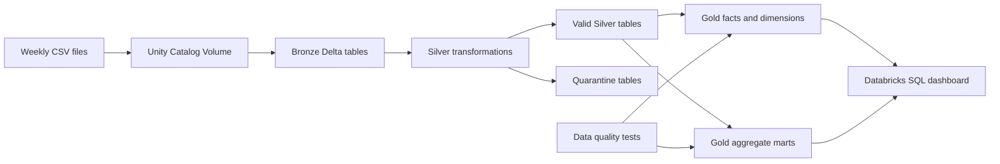

# Databricks Retail Lakehouse Analytics Pipeline

An end-to-end data engineering portfolio project built for **Databricks Free Edition** with PySpark, Spark SQL, Delta Lake, Unity Catalog, Databricks Workflows, and Databricks SQL.

The pipeline ingests weekly retail transaction extracts and a deliberately dirty user dataset, preserves the raw data in Bronze, cleans and validates records in Silver, and publishes analytics-ready Gold tables for reporting.

## Architecture



## Engineering features

- Explicit source schemas
- Incremental filename-based ingestion
- Idempotent reruns
- Source-file lineage and ingestion timestamps
- Managed Delta tables in Unity Catalog
- Product-name and categorical-value normalization
- Multi-format date handling
- Type enforcement and arithmetic reconciliation
- Duplicate detection and invalid-record quarantine
- Gold star schema and reusable aggregate tables
- Automated tests for uniqueness, completeness, validity, accuracy, and referential integrity
- Five-stage Databricks Workflow
- Databricks SQL executive dashboard queries

## Source data

The raw files come from Alex Freberg's public Databricks tutorial repository:

- [Data Engineering source folder](https://github.com/AlexTheAnalyst/DatabricksSeries/tree/main/Data%20Engineering)
- `transactions_2025_01_06.csv`
- `transactions_2025_01_13.csv`
- `transactions_2025_01_20.csv`
- `transactions_2025_01_27.csv`
- `users_dirty.csv`

The source data is credited to its original author and is not duplicated in this repository.

## Important modeling decision

Transaction records use customer IDs such as `C4657`, while the user dataset uses IDs such as `USR_1000`. No crosswalk is supplied. The project therefore treats sales and user acquisition as separate analytical domains rather than creating an unsupported customer-level join.

## Repository structure

```text
.
├── README.md
├── architecture.md
├── docs/
│   ├── data_dictionary.md
│   └── testing_strategy.md
└── notebooks/
    ├── 00_setup.sql
    ├── 01_bronze_ingestion.py
    ├── 02_silver_transformations.py
    ├── 03_gold_models.sql
    ├── 04_data_quality_tests.py
    └── 05_pipeline_summary.sql
```

## Run instructions

### 1. Create the Databricks objects

Import and run [`notebooks/00_setup.sql`](notebooks/00_setup.sql). It creates:

```text
retail_portfolio.landing
retail_portfolio.bronze
retail_portfolio.silver
retail_portfolio.gold
retail_portfolio.monitoring
```

It also creates the managed volume:

```text
/Volumes/retail_portfolio/landing/raw_files
```

### 2. Upload the source files

Upload the four transaction CSVs into:

```text
/Volumes/retail_portfolio/landing/raw_files/transactions
```

Upload `users_dirty.csv` into:

```text
/Volumes/retail_portfolio/landing/raw_files/users
```

For the clearest incremental-processing demonstration, upload and process one weekly transaction file at a time.

### 3. Run the notebooks in order

1. `00_setup.sql`
2. `01_bronze_ingestion.py`
3. `02_silver_transformations.py`
4. `03_gold_models.sql`
5. `04_data_quality_tests.py`
6. `05_pipeline_summary.sql`

### 4. Configure the Databricks Workflow

Create a job named **Retail Lakehouse Daily Pipeline** with these dependencies:

```text
bronze_ingestion
        ↓
silver_transformations
        ↓
gold_models
        ↓
data_quality_tests
        ↓
pipeline_summary
```

The data-quality notebook raises an exception when a test fails, which prevents a bad pipeline run from appearing successful.

## Gold tables

The final managed Delta tables are stored under:

```text
retail_portfolio.gold
```

Principal tables:

| Table | Purpose |
|---|---|
| `fact_sales` | Transaction-level sales fact table |
| `dim_product` | Product dimension |
| `dim_store` | Store dimension |
| `dim_date` | Calendar dimension |
| `daily_sales_summary` | Daily revenue and order KPIs |
| `product_performance` | Product and category performance |
| `store_performance` | Store-level sales performance |
| `payment_method_performance` | Payment mix and revenue |
| `user_acquisition_summary` | Signup performance by year, country, and channel |
| `monthly_user_signups` | Monthly signup trends by channel |

Query a Gold table from a SQL notebook or Databricks SQL:

```sql
SELECT *
FROM retail_portfolio.gold.fact_sales
LIMIT 100;
```

Or with PySpark:

```python
df = spark.table("retail_portfolio.gold.fact_sales")
display(df)
```

## Suggested dashboard tiles

Use the Gold tables to create:

- Total revenue
- Transaction count
- Units sold
- Average order value
- Unique customers
- Daily revenue trend
- Product revenue ranking
- Store revenue ranking
- Payment-method mix
- Signup volume by acquisition channel and country
- Latest data-quality results

## Portfolio talking points

- Designed an incremental ingestion process that skips previously processed filenames.
- Preserved raw source values and operational metadata in Bronze Delta tables.
- Standardized inconsistent product labels and parsed dirty source dates in Silver.
- Retained invalid and duplicate records in quarantine tables instead of silently deleting them.
- Built a star-schema sales model and separate user-acquisition mart based on the actual join keys available.
- Added executable tests that stop the workflow when quality expectations fail.

## Resume bullets

- Built an end-to-end medallion lakehouse pipeline in Databricks using PySpark, Spark SQL, Delta Lake, and Unity Catalog to process incremental weekly retail transaction files.
- Developed idempotent ingestion logic with explicit schemas, source-file lineage, audit logging, and filename-based incremental processing.
- Implemented data cleansing, type enforcement, date parsing, transaction-value reconciliation, deduplication, and invalid-record quarantine workflows.
- Modeled analytics-ready Gold datasets with sales facts, reusable dimensions, and business aggregates for product, store, payment, and acquisition analysis.
- Created automated data-quality tests and orchestrated a dependency-based Databricks job whose execution fails when expectations are violated.
