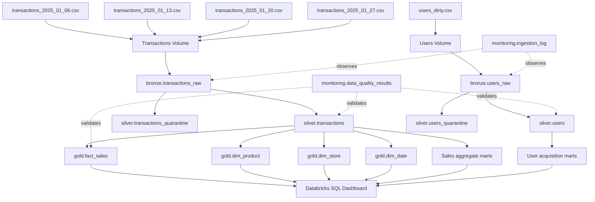
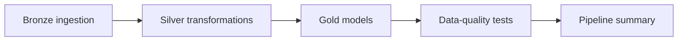

# Architecture and Design Decisions

## Medallion data flow

## Layer responsibilities

### Landing

The Unity Catalog managed volume stores source files exactly as delivered. Files are separated into transaction and user directories.

### Bronze

Bronze tables are append-only and retain all business columns as strings. Each row also carries:

- `source_file`
- `source_file_path`
- `ingested_at`
- `ingestion_date`

Incremental ingestion compares landing filenames with filenames already present in the Bronze target table.

### Silver

Silver applies:

- Whitespace normalization
- Case standardization
- Data-type conversion
- Identifier validation
- Positive-value checks
- Transaction arithmetic reconciliation
- Duplicate ranking
- Quarantine routing

Silver tables contain one trusted record per business key. Invalid and duplicate rows remain available in separate quarantine tables for diagnosis.

### Gold

Gold contains two analytical domains:

1. **Sales:** transaction facts, date/product/store dimensions, and sales aggregates.
2. **User acquisition:** signup aggregates by date, country, and referral source.

The domains remain separate because the source datasets do not share a documented customer key.

## Orchestration

A failed data-quality test raises a runtime exception and stops the workflow before the run is marked successful.

## Production extensions

A production-scale implementation could add:

- Auto Loader and checkpoints instead of directory enumeration
- A central pipeline-control table
- Run-level correlation IDs
- Schema evolution review and data contracts
- MERGE-based change processing
- Slowly changing dimensions
- Alerting and freshness SLAs
- CI validation for notebook source files
