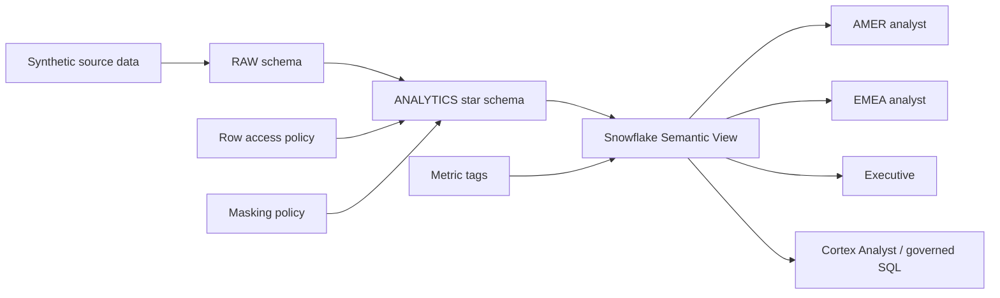

# Governed Job Marketplace Semantic Layer with Snowflake

A portfolio project demonstrating how to build a governed analytics contract for a job marketplace with Snowflake Semantic Views.

> **Project context:** This is an anonymized reconstruction inspired by marketplace analytics patterns I encountered while working at Indeed. All employers, job postings, users, contact details, and performance records are synthetic. The repository contains no Indeed source code, confidential data, or claim that this exact implementation was deployed in Indeed production.

## Business problem

Marketplace teams need consistent answers to questions such as:

- How many impressions, clicks, applications, qualified applications, and hires were generated?
- How do conversion rates vary by employer, job, market, device, and traffic source?
- How efficiently does sponsored spend generate applications?
- Which metrics are approved for reporting?
- Which markets and sensitive fields should each role be allowed to see?

Without a governed semantic layer, analysts and dashboards can independently recreate calculations such as apply rate or cost per application, producing inconsistent definitions and uncontrolled access to internal data.

## Solution

I built a Snowflake Semantic View over a dimensional job-marketplace model and implemented:

- Private additive facts and public certified metrics
- Employer, job, calendar, and performance relationships
- Business descriptions and synonyms for semantic discovery
- Cortex Analyst instructions and a verified query
- Metric certification and data-classification tags
- Regional row-access policies for AMER and EMEA analysts
- Dynamic masking for internal account-manager email addresses
- Role-based access that prevents analysts from querying base tables directly
- Physical-to-semantic metric reconciliation tests

## Architecture



The semantic model follows this relationship path:

```text
Employer 1 ──< Job 1 ──< Daily Performance >── 1 Calendar Date
```

The performance fact grain is:

```text
event_date + job_id + device_type + traffic_source
```

See the detailed model in [`docs/data_model.md`](docs/data_model.md).

## Snowflake objects

| Layer | Objects |
|---|---|
| Compute | `JOB_MARKETPLACE_WH` |
| Database | `JOB_MARKETPLACE` |
| Schemas | `RAW`, `ANALYTICS`, `GOVERNANCE`, `SEMANTIC` |
| Dimensions | `DIM_EMPLOYER`, `DIM_JOB`, `DIM_DATE` |
| Fact | `FCT_JOB_PERFORMANCE_DAILY` |
| Semantic view | `JOB_MARKETPLACE_PERFORMANCE` |
| Governance | Three tags, one row-access policy, one masking policy, and a role-to-region mapping table |

## Certified metric contract

The semantic view exposes 13 public metrics while keeping the additive source measures private.

| Category | Certified metrics |
|---|---|
| Volume | Active jobs, impressions, clicks, applications, qualified applications, hires, sponsored spend |
| Conversion | Click-through rate, apply rate, qualified-application rate, hire rate |
| Efficiency | Cost per application, cost per qualified application |

Percentage and efficiency metrics are calculated from aggregated numerators and denominators. Daily percentages are never averaged.

Full definitions are documented in [`docs/metric_definitions.md`](docs/metric_definitions.md).

## Governance model

| Role | Market access | Account-manager email | Base-table access |
|---|---|---|---|
| `JOB_MARKETPLACE_AMER_ANALYST` | AMER only | Masked | Denied |
| `JOB_MARKETPLACE_EMEA_ANALYST` | EMEA only | Masked | Denied |
| `JOB_MARKETPLACE_EXECUTIVE` | All markets | Visible | Denied |
| `JOB_MARKETPLACE_SEMANTIC_OWNER` | All markets | Visible | Required for deployment |

Governance is enforced on the underlying analytics tables so the restrictions propagate through the semantic view.

## Repository structure

```text
snowflake-job-marketplace-semantic-layer/
├── README.md
├── .gitignore
├── docs/
│   ├── data_model.md
│   └── metric_definitions.md
└── sql/
    ├── 01_environment.sql
    ├── 02_raw_data.sql
    ├── 03_analytics_models.sql
    ├── 04_data_quality_tests.sql
    ├── 05_governance.sql
    ├── 06_semantic_view.sql
    ├── 07_semantic_queries.sql
    ├── 08_access_tests.sql
    └── 09_final_validation.sql
```

## Build order

Run the SQL files in numerical order in Snowflake Workspaces:

| File | Purpose |
|---|---|
| `01_environment.sql` | Creates the warehouse, database, schemas, roles, and grants |
| `02_raw_data.sql` | Generates synthetic employer, job, and daily funnel data |
| `03_analytics_models.sql` | Builds the dimensional analytics layer |
| `04_data_quality_tests.sql` | Tests row counts, fact grain, referential integrity, and funnel rules |
| `05_governance.sql` | Creates tags, regional row access, and email masking |
| `06_semantic_view.sql` | Defines the governed Snowflake Semantic View |
| `07_semantic_queries.sql` | Inspects metadata, queries metrics, and reconciles calculations |
| `08_access_tests.sql` | Tests analyst and executive access behavior |
| `09_final_validation.sql` | Runs the consolidated portfolio validation suite |

### Requirements

- A Snowflake account with permission to use `ACCOUNTADMIN`
- Snowflake Enterprise Edition or a suitable trial for Dynamic Data Masking
- Access to Snowflake Workspaces in Snowsight

## Validation

The project includes tests for:

- Expected row counts, including 3,204 daily performance records
- Unique fact grain
- Job and calendar referential integrity
- Valid impression-to-hire funnel sequencing
- Sponsored-spend business rules
- Semantic-object metadata
- Physical-to-semantic metric reconciliation
- AMER-only and EMEA-only row access
- Masked analyst email output
- Unmasked executive email output
- Intentional denial of analyst access to the underlying fact table

A successful final validation has:

```text
All data-quality checks: PASS
All reconciliation rows: PASS
AMER analyst regions: AMER only
EMEA analyst regions: EMEA only
Executive regions: AMER, APAC, EMEA
Analyst base-table query: access-control error (expected)
```

The final access-control error is intentional: it proves consumers must use the governed semantic layer instead of bypassing it.

## Example semantic query

```sql
SELECT *
FROM SEMANTIC_VIEW(
    JOB_MARKETPLACE.SEMANTIC.JOB_MARKETPLACE_PERFORMANCE

    DIMENSIONS
        CALENDAR.MONTH_START,
        JOBS.MARKET_REGION

    METRICS
        PERFORMANCE.TOTAL_IMPRESSIONS,
        PERFORMANCE.TOTAL_CLICKS,
        PERFORMANCE.TOTAL_APPLICATIONS,
        PERFORMANCE.APPLY_RATE
)
ORDER BY MONTH_START, MARKET_REGION;
```

## Key design decisions

1. **Certified metrics instead of repeated dashboard formulas**  
   Business consumers query named metrics rather than rebuilding calculations.

2. **Private facts and public metrics**  
   Additive building blocks remain hidden while governed metrics remain reusable.

3. **Policies on physical models**  
   Row access and masking remain effective when data is queried through the semantic layer.

4. **No direct analyst access to base tables**  
   Consumers cannot bypass the semantic contract or its security controls.

5. **Reconciliation before certification**  
   Semantic results are compared with authoritative physical SQL at the same reporting grain.

## Technology stack

- Snowflake
- Snowflake Semantic Views
- Snowflake SQL
- Cortex Analyst metadata
- Role-based access control
- Row Access Policies
- Dynamic Data Masking
- Object Tags
- Git and GitHub

## Full [portfolio](https://docs.google.com/document/d/1SUDN3kGx39rz5Dp-Zsn3EfDgNE8PBm15iujdAQW0Hkg/edit?tab=t.0)

https://docs.google.com/document/d/1SUDN3kGx39rz5Dp-Zsn3EfDgNE8PBm15iujdAQW0Hkg/edit?tab=t.0
