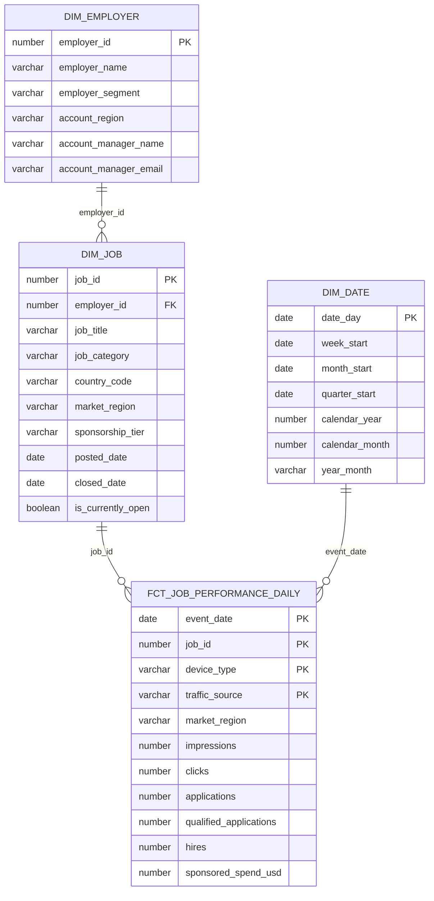

# Data Model

## Entity relationship diagram



## Declared grains

| Model | Grain |
|---|---|
| `DIM_EMPLOYER` | One row per employer account |
| `DIM_JOB` | One row per job posting |
| `DIM_DATE` | One row per calendar date |
| `FCT_JOB_PERFORMANCE_DAILY` | One row per event date, job, device type, and traffic source |

## Relationship paths

```text
DIM_EMPLOYER.employer_id
    1 ──< DIM_JOB.employer_id

DIM_JOB.job_id
    1 ──< FCT_JOB_PERFORMANCE_DAILY.job_id

DIM_DATE.date_day
    1 ──< FCT_JOB_PERFORMANCE_DAILY.event_date
```

The semantic view uses one unambiguous path from employer to job to performance. Calendar attributes join directly to the daily performance fact.

## Modeling rationale

- Employer attributes are modeled separately from jobs to avoid repeating account data.
- Job attributes are conformed across every performance slice.
- Calendar fields support governed day, week, month, quarter, and year aggregation.
- Funnel amounts remain additive at the declared fact grain.
- Conversion metrics are calculated only after aggregation.
- `market_region` exists on both the job dimension and performance fact so row-access controls protect metric queries and dimension-only queries.
